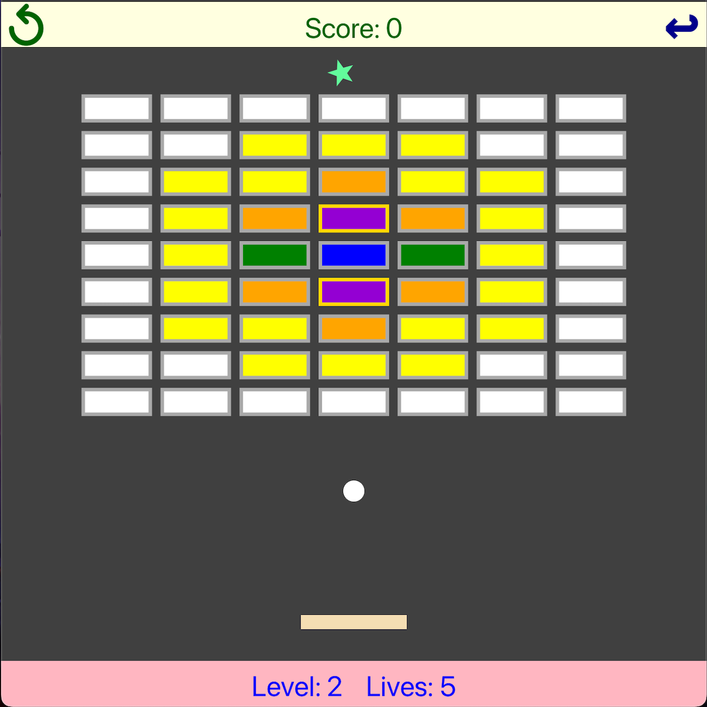

# Breakout Game

## **Overview**

  

**Breakout** is a classic arcade game, reimagined with modern features, multiple levels, and a relatively usable physics system. This project implements the game using an Entity-Component-System (ECS) architecture, making the game highly extensible and allowing for advanced game logic, such as collisions and power-ups.

## **Key Features**

- **Core Gameplay:**
    - Control the paddle using the arrow keys `←` and `→` and try to keep the ball (bouncer) in play while destroying bricks.
    - The paddle can be warped if it crosses the screen edges.
    - Paddle’s horizontal velocity influences the ball’s movement, making it partially controllable.

- **Special Blocks:**
    - **Multi Hit Block:** Takes multiple hits to destroy.
    - **Explosive Block:** Explodes and damages surrounding blocks.
    - **Laser Block:** Fires a horizontal laser that damages blocks in the same row.

- **Power-ups:**
    - **Extra Life:** Gives an additional life for a limited time.
    - **Longer Paddle:** Expands the paddle for better control.
    - **Speed Up:** Increases the speed of the ball temporarily.
    - **Icy Paddle:** Makes the paddle slippery (no velocity decrease).

- **Cheat Keys:** Unlock extra features (extra life, reset positions, etc.) during gameplay **(but will mark the score as CHEATED)**.

- **Multiple Levels:** Easily add new levels by including new `.level` files. Check [here](src/main/resources/breakout/level/LEVEL_0.level) for example.

- **Collision System:** An simple ECS-based collision detection and resolution, providing realistic and dynamic gameplay interactions.

## **Project Attributions**

- **Learning Resources:**
    - [Game Engine Design (ECS)](https://thecherno.com/engine)
    - [Unity Scripting Guide](https://docs.unity3d.com/Manual/ScriptingSection.html)
    - [Collision Detection](https://learnopengl.com/In-Practice/2D-Game/Collisions/Collision-detection)

- **Assets Used:**
    - [Duke University Seal](https://www.pngkit.com/view/u2q8w7y3w7t4e6u2_duke-university-seal-duke-university-seal-logo/)

## **Gameplay and Running**

### **Key Inputs**

- **Arrow Keys:** Move the paddle (only horizontal movement)
- **Mouse Left Click:** Interact with the UI
- **P:** Pause the game
- **S:** Restart the current level
- **0-9:** Load levels (currently level 0-3; levels beyond 3 will load the last level)
- **Cheat Keys:**
    - **L:** Gain an extra life
    - **R:** Reset paddle and ball positions without resetting the level

### **Dependencies and Setups**

- **Build Environment:** Java 11 or higher
- **External Package:** JavaFX (should be included in the JDK)

## **Reflection & Challenges**

Implementing the ECS system was both the most challenging and rewarding part of this project. Debugging the complex collision interactions took a significant amount of time, but seeing it work in the final game was very satisfying. I look forward to refining the ECS architecture in future updates to make it more flexible and robust.
